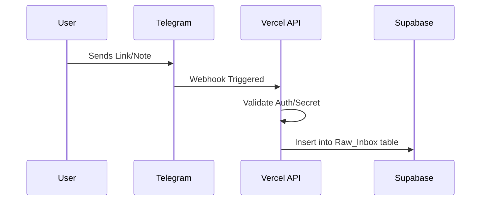
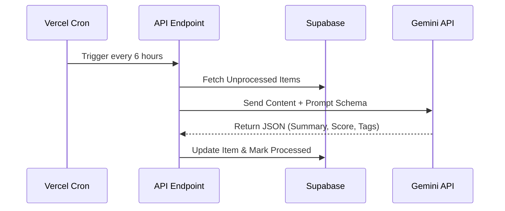

# MASTER PROMPT: Personal OS Product Requirements Document

*Instructions for the AI Assistant: You are acting as the Lead Engineer. This document is the comprehensive Product Requirements Document (PRD) for my Personal OS. Read this document carefully. Your goal is to implement this system step-by-step into my existing Astro repository (bhaskarkotakonda.github.io). Follow the architecture, constraints, and phased implementation strictly.*

---

## 1. Product Vision & Principles

The goal is to build a "Personal Backend OS" integrated directly into my existing public portfolio website. 
*   **Zero-Friction Capture:** I must be able to send ideas, links, and media to my OS from my phone (via Telegram) in seconds.
*   **Design Parity:** The OS must use the exact same aesthetic, fonts, and Tailwind design variables as my current public portfolio. No generated, generic "AI UI". It must feel like a hidden, premium extension of my site.
*   **Mobile-First:** The Dashboard and Library views must be entirely responsive and usable on the go.
*   **Cost Efficiency:** Maximize free-tier services. Do not introduce recurring paid APIs unless explicitly stated.

---

## 2. Global Pre-requisites & Account Setup
*Before writing code, the user will need to configure the following services. The system relies on these environment variables.*

### 2.1 Services Required
1.  **Hosting**: Vercel. We are migrating the Astro site from GitHub Pages (static) to Vercel (SSR) to support server APIs.
2.  **Database**: Supabase (Free Tier: 500MB DB). If data exceeds 500MB long-term, older raw text data can be archived, though 500MB is enough for ~100,000 text bookmarks.
3.  **Authentication**: Clerk (Free Tier). 
4.  **AI Engine**: Google Gemini API (Using Gemini 1.5 Pro).
5.  **Messaging Portal**: Telegram Bot API (100% Free).

### 2.2 Environment Variables (To be stored in `.env`)
```env
# Clerk Auth
PUBLIC_CLERK_PUBLISHABLE_KEY=pk_...
CLERK_SECRET_KEY=sk_...

# Supabase
PUBLIC_SUPABASE_URL=https://...supabase.co
PUBLIC_SUPABASE_ANON_KEY=eyJ...
SUPABASE_SERVICE_ROLE_KEY=eyJ...

# Telegram Bot
TELEGRAM_BOT_TOKEN=123456:ABC-DEF1234...
TELEGRAM_WEBHOOK_SECRET=your_custom_secret

# AI
GEMINI_API_KEY=AIza...
```

---

## 3. Architecture & Security Requirements

*   **Framework**: Astro (configured for `output: 'server'` with the Vercel adapter).
*   **Frontend UI**: React components styled with the existing `tailwind.config.js`.
*   **Security Boundary**: 
    *   `/` (Public Portfolio) -> Remains accessible to the world.
    *   `/os/*` (The Brain) -> Protected by Clerk middleware. Any unauthenticated access to these routes, or API endpoints under `/api/os/*`, must redirect or return 401 Unauthorized. It is impossible to share a "corrupted" or unauthorized link, as Clerk strictly enforces session validation.

---

## 4. Core Modules & Workflows

### Module A: The Capture Layer (Ingestion)

*How data enters the system without opening the app.*

1.  **Telegram Bot (Primary Mobile Interface)**:
    *   *Workflow*: I message my private Telegram bot with a link, text, or audio note. Telegram hits our Vercel API endpoint (`/api/webhooks/telegram`). 
    *   *Processing*: The API extracts the payload, validates the webhook secret, and inserts the raw message into the Supabase `Raw_Inbox` table.
2.  **Platform Scraping Constraints & Costs**:
    *   *Twitter/Reddit*: X API is prohibitively expensive. *Strategy*: Fallback to manual ingestion via Telegram (sharing the tweet to the bot).
    *   *LinkedIn*: Scraping is unreliable due to strict bot protection. *Strategy*: Manual sharing to Telegram.
    *   *YouTube*: When a YouTube link is sent to Telegram, a background Vercel serverless function uses `youtube-transcript-api` (Free Python/JS package) to pull the captions.
    *   *Newsletters*: Set up a free forwarding rule (e.g., via Cloudflare Email Routing) to an email parser endpoint that dumps the HTML body into `Raw_Inbox`.

### Module B: The AI Processing Agent

*How data is synthesized.*

1.  **The Cron Job**: Vercel Cron triggers `/api/cron/process-inbox` every 6 hours.
2.  **Deduplication (Phase 1)**: Simple URL canonicalization. (Semantic Vector Deduplication via pgvector is deferred to Phase V2 to reduce initial complexity).
3.  **LLM Processing**: The script fetches unprocessed rows from `Raw_Inbox` and sends them to Gemini 1.5 Pro with a strict JSON schema prompt.
4.  **Data Extraction**: Gemini returns:
    *   `Title`, `Summary` (TL;DR).
    *   `Tags` (e.g., "Engineering", "Life", "Finance").
    *   `Importance_Score` (1-10): Based on a config file (`src/os/ai_config.ts`) that I can edit directly in the repo to define what is currently "important" to me.
    *   `Actionable_Takeaways`: List of bullet points.
5.  **Study Mode Generation**: If `Importance_Score` > 8, Gemini generates a deep-dive "Study Guide" (markdown formatted) containing core concepts and mental models extracted from the piece.

### Module C: The Frontend OS (UI Specifications)

*How data is consumed. Must use exact existing Tailwind classes for typography and colors.*

*   **Command Center (`/os/dashboard`)**:
    *   A mobile-optimized, feed-style view showing recently processed items with `Importance_Score` > 6.
    *   Visuals: Clean cards with the original context link, tags, and the TL;DR.
*   **The Library (`/os/library`)**:
    *   A searchable data table/grid of all processed content.
    *   Filter dropdowns for Tags and Importance thresholds.
*   **Study Mode (`/os/study/[id]`)**:
    *   A focused, distraction-free reading view using Astro's typography plugin to render the AI-generated markdown Study Guides beautifully.

---

## 5. Visual Workflows

### Data Capture Workflow


### AI Processing Workflow


---

## 6. Execution Instructions (For the AI)

*Start implementation in this exact order. Do not skip steps.*

*   **Phase 1: Foundation & Auth**
    1.  Update `astro.config.mjs` to standard Vercel SSR.
    2.  Install `@clerk/astro` and implement middleware to firmly block `/os/*`.
    3.  Build a wireframe `/os/dashboard` that proves auth works.
*   **Phase 2: Database Layer**
    1.  Provide the exact SQL commands to run in the Supabase SQL Editor to create `Raw_Inbox` and `Processed_Nodes` tables.
    2.  Write a Supabase generic client utility in `src/os/lib/supabase.ts`.
*   **Phase 3: Telegram Webhook**
    1.  Build `/pages/api/webhooks/telegram.ts`.
    2.  Write text parsing to extract URLs from incoming bot messages.
*   **Phase 4: The Brain (Gemini)**
    1.  Create `src/os/ai_config.ts` so the user can define importance rules.
    2.  Build `/pages/api/cron/process.ts` that calls Gemini and updates the DB.
*   **Phase 5: UI & UX**
    1.  Implement the React components for the Dashboard, mapping the existing Tailwind design variables to the new OS cards.
    2.  Implement the Study Mode renderer.
